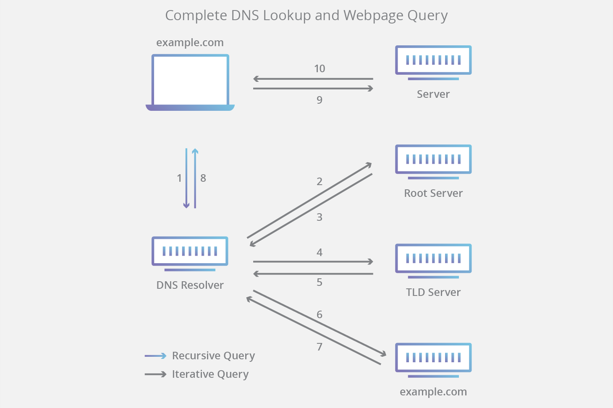
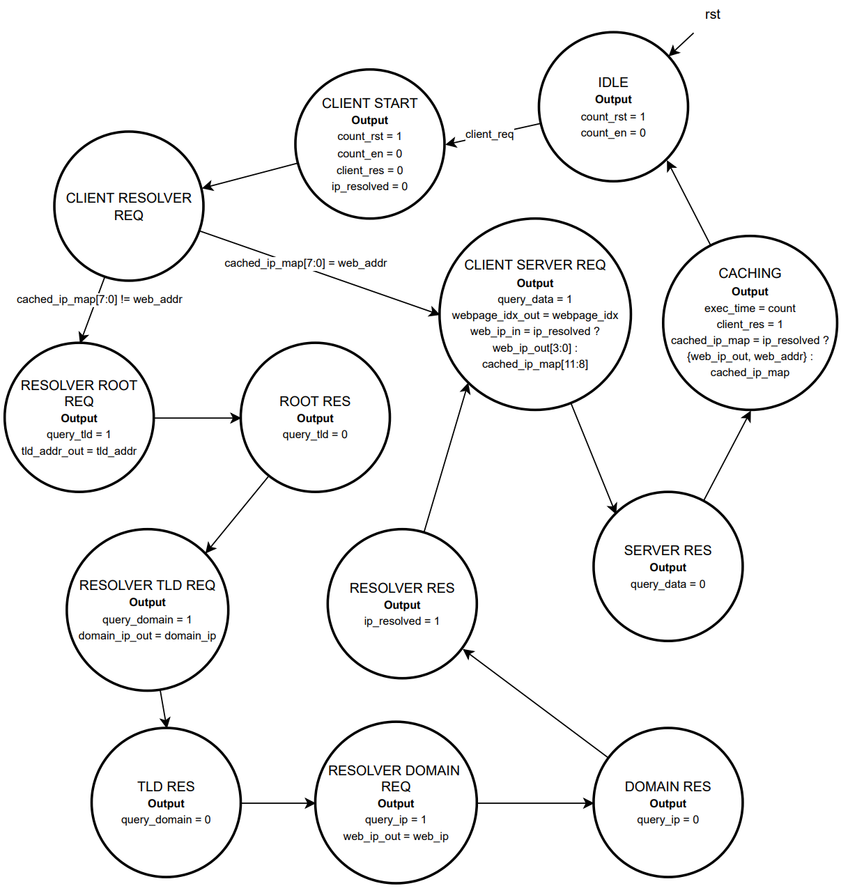
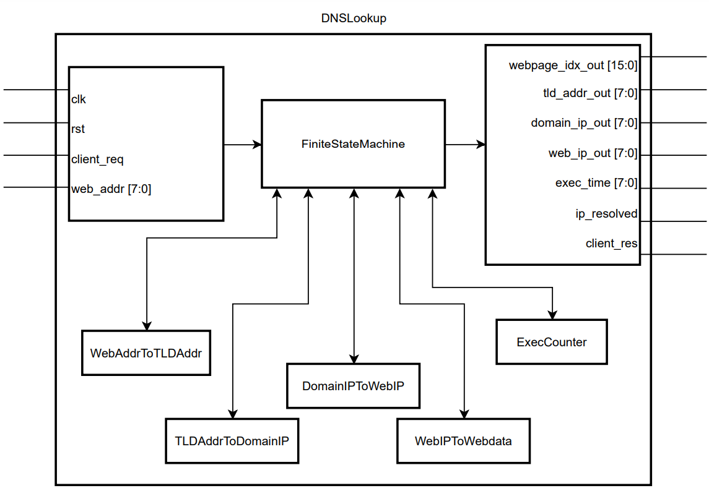
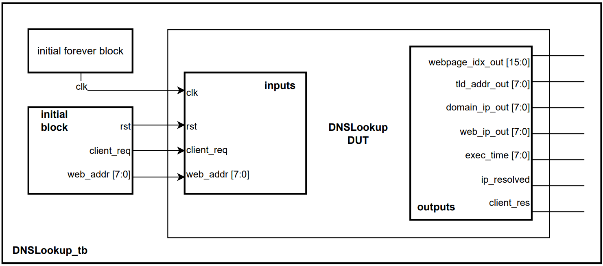
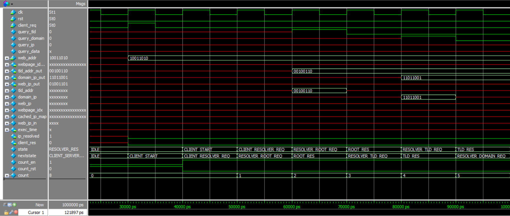
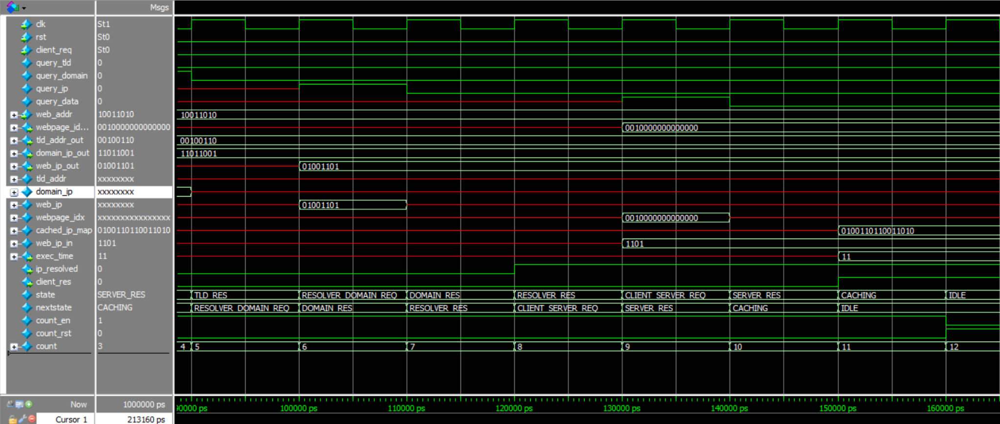

University of British Columbia  

*Isabelle Andre*  

# Table of Content

1. [DNS Lookup and Webpage Query Background](#dns-lookup-and-webpage-query-background)
2. [State Machine Description](#state-machine-description)
3. [States Description](#states-description)
4. [Inputs Description](#inputs-description)
5. [Outputs Description](#outputs-description)
6. [Modules](#modules)
7. [States Transition Diagram](#state-transition-diagram)
8. [Block Diagram](#state-machine-block-diagram)
9. [Waveforms](#waveform-and-testbench-simulations)

# Project 1 DNS Lookup Verilog FSM
This project consisted in creating a custom finite state machine in system verilog and a testbench to verify its design. As freedom of topic for this project was given, an FSM depicting the process of a complete DNS lookup and Webpage Query was created. This state machine contains 13 states, including the multiple stages of recursive and iterative queries between different data servers. Depending on the web address queried from the client, an address may be mapped to its corresponding IP address and cached in the browser for future usage, decreasing the total execution time of the lookup process.

## DNS Lookup and Webpage Query Background
When a client accesses a website, a Domain Name System (DNS) is used to locate the server at which the domain’s website is located. This process allows the mapping from a web address such as www.google.com, to its corresponding IP address, 172.217.12.46 in the background.

### DNS Servers
There are four relevant DNS servers to this process.  

First, the **DNS Resolver** is designed to receive queries from client machines through various
applications, such as web browsers. The recursor then makes requests as needed to other
servers in order to resolve the client’s initial query.  

The **Root Nameserver** maps and returns the corresponding Top Level Domain server
address to a web address.  

The **Top Level Domain (TLD) Nameserver** hosts a portion of a host name, such as .com or
.ca. The TLD Nameserver maps and returns the corresponding Authoritative Nameserver
address to a web address.  

Finally, the **Authoritative Nameserver** contains a record of every IP address within its
domain. If the server has access to the requested record, it returns the corresponding IP
address for the requested hostname.  

Once a web address is accessed, the address of any of these servers may be cached by the
OS, reducing the time of execution of this procedure. However in this project, we will not
take OS caching into account and simply focus on a single address browser caching policy.  

## State Machine Description
The DNS Lookup process begins with the user entering a web address into a browser such as
google.ca, received by a DNS recursive resolver. The resolver uses this address to query a
DNS root nameserver, which in turn responds with the address of a TLD DNS server, such
as .ca. Once the resolver then queries to the .ca TLD server, and receives the IP address of
the domain’s nameserver for google.ca. The resolver sends another query to the domain’s
nameserver, which returns the corresponding IP address for google.ca. Finally, the DNS
server is able to return the corresponding IP address to the web browser for the requested
domain.  

Once the client browser receives a response, it makes an HTTP request to the IP address.
The server at the IP address returns the webpage data and components to render the
website.  

The state machine includes a caching state in which the browser is able to cache the IP
address of the latest website accessed. If the same website is accessed the next request, the
FSM skips the DNS lookup process, and is able to directly make an HTTP request to the
cached IP address. This is a very simplified approach to simulate the caching abilities of
browsers to reduce request latency, and does not include OS caching or caching server
addresses.  

Figure 1 describes this process and the iterative nature of server requests from the DNS
resolver. Note that this is not a complete state transition diagram, and simply a
representation of the servers and client interactions.

*Cloudflare, What is DNS?, 2022, https://www.cloudflare.com/learning/dns/what-is-dns/*
*Figure 1: Complete DNS Lookup and Webpage Query*

### States Description
* **IDLE:** Initial state. If a client request arrives, reset execution time counter  
* **CLIENT START:** Start execution time counter and begin to process request  
* **CLIENT RESOLVER REQ:** Browser cache is queried to see if web address matches a cached IP address. If so, the state machine skips to CLIENT SERVER REQ. If not, the client query is sent to the DNS Resolver for a DNS Lookup.  
* **RESOLVER ROOT REQ:** Resolver request is sent to a Root Nameserver. A query bit is enabled to allow a mock TLD address to be processed and returned.  
* **ROOT RES:** The mock TLD address is generated and returned.  
* **RESOLVER TLD REQ:** The Resolver sends a request to the TLD server. A query bit is enabled to allow a mock Domain Nameserver address to be processed and returned.  
* **TLD RES:** The mock Domain Nameserver address is generated and returned.  
* **RESOLVER DOMAIN REQ:** The Resolver sends a request to the Domain Nameserver. A query bit is enabled to allow a mock web IP address to be processed and returned.  
* **DOMAIN RES:** The mock web IP address is generated and returned.  
* **RESOLVER RES:** The DNS Resolver responds to the client with the IP address of the domain requested. The IP address was found through DNS Lookup and resolved.  
* **CLIENT SERVER REQ:** The client browser makes an HTTP request to the IP address. If the IP address was found through DNS Lookup, use this address, if not, use the cached address. A query bit is enabled to allow mock web data to be processed and returned.  
* **SERVER RES:** The mock web data is generated and returned.  
* **CACHING:** The last used IP address is cached in the browser. The execution time counter is terminated and outputted, and the client request has been resolved. The state machine returns to the IDLE state until the next client request arrives.

### Inputs Description
* **clk:** Input clock signal.
* **rst:** Input reset signal.
* **client req:** Flag indicating an incoming client request.
* **web addr:** Mock client web address requesting corresponding IP address.

### Outputs Description
* **webpage idx out:** Mock web page data output corresponding for website rendering.
* **tld addr out:** Mock Top Level Domain address.
* **domain ip out:** Mock Domain Nameserver IP address.
* **web ip out:** Mock web IP Address corresponding to initial client query.
* **exec time:** Total execution time for DNS Lookup and caching process, simulated by counting cycles.
* **ip resolved:** Mock web IP address was found during DNS Lookup.
* **client res:** Web data has been returned and rendered, state machine is complete.

### Modules
* **DNSLookup:** Main state machine.
* **ExecCounter:** A simple up-counter to count mock execution time in cycles.
* **WebAddrToTLDAddr:** A simple shifting module to generate a mock TLD address returned to the Resolver. This simulates a Root Nameserver, returning the corresponding TLD address to a Web Address.
* **TLDAddrToDomainIP:** A simple XOR module to generate a mock Domain address returned to the Resolver. This simulates a TLD Server, returning the corresponding Domain address to a Web Address.
* **DomainIPToWebIP:** A module of combined operations to generate a mock IP address returned to the Resolver. This simulates a Domain Nameserver, returning the corresponding IP address to a Web Address.
* **WebIPToWebdata:** A 4 to 16 Decoder module generating mock web data upon an HTTP request to an IP address. This simulates the web data being returned and rendered in a browser. In a normal rendering process, multiple HTTP requests would be made until the website is fully rendered.

### Assumptions
As this project allows for much flexibility in design, assumptions were made when designing this state machine. First, the initial client queried web address is represented by an 8 bit value chosen arbitrarily, and inputted to the state machine.

As it is not possible to accurately simulate the correct server and IP addresses for a mock web address represented by bits, modules operating on the mock web address were designed in order to simulate Root, TLD, and Domain server responses to the Resolver. These addresses were then outputted by the state machine. The operations applied to the addresses were chosen arbitrarily, such that results can be reproduced.

As previously mentioned in section 2.1, the state machine includes a caching mechanism. However we simply cache a single IP address mapped to the most recently queried web address, to simulate a single block browser caching policy.

Lastly, the total execution time of the DNS Lookup process is an output to the state machine, and simulated by counting the number of clock cycles from the client request to the client resolution.

## State Transition Diagram
The DNS Lookup state machine described in Section 3.0 is shown by Figure 4.1. In this state transition diagram, inputs to the state machine as well as all outputted signals per individual state are displayed.

*Figure 4.1: DNS Lookup State Transition Diagram*

## State Machine Block Diagram
A state machine and module block diagram depicting the state transitions are shown below in Figure 5.1 and Figure 5.2. The top level DNSLookup FSM module contains all modules.

*Figure 5.1: DNSLookup Top Level FSM Module*

Figure 5.3 describes the input and output connections of the DNSLookup top level module DUT and the testbench. This testbench stimulates a clock signal every 5 ps, a reset signal, a client request flag signal, and a mock web address chosen arbitrarily. The objective of this testbench is not only to check the correctness of the output signals, but also to observe the state transitions when a client requests multiple addresses consecutively as the functioning of the browser caching mechanism can be verified.

*Figure 5.3: DNSlookup Testbench and Top Level Module Connections*

## Waveform and Testbench Simulations
A SystemVerilog Testbench was designed in order to test the FSM design and simulate various cases. In our test bench, three mock web addresses were simulated to test the caching and address mapping behaviors of the DNS Lookup state machine.

The first stimulated client query is an arbitrary Web Address (A) represented by 8 bits. In Figure 6.1 a), the query reaches the DNS Resolver, which queries the Root, TLD, and Domain servers one by one until the correct IP address is found in Figure 6.1 b). The IP Address is returned to the client, initiating an HTTP request, then cached for future use once webdata is returned and client query is resolved. The total execution time is counted to be 12.

*Figure 6.1 a): Web Address (A) is queried by client. Servers return corresponding addresses.*

*Figure 6.1 b): Corresponding IP Address to Web Address (A) is resolved, cached, and returned to client.*