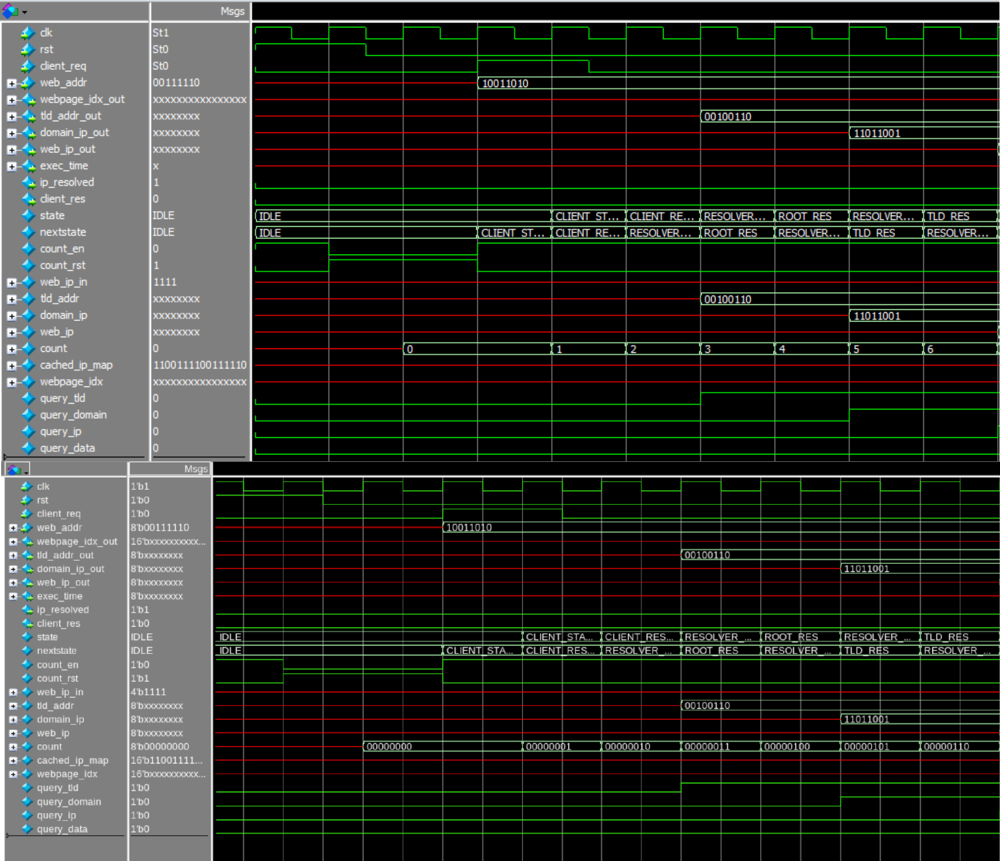

University of British Columbia  

*Isabelle Andre*  

# Project 2 Synthesized Verilog Project
This project consisted in using Cadence Encounter RTL Compiler to generate a mapped netlist based on a provided library of cells. The same DNS Lookup System Verilog FSM from Assignment 1 was used to create a netlist. The total number of cells and time slack of this FSM was generated by the RTL Compiler, and the generated graphical waves of the mapped Verilog file were compared to the initial waveforms from Assignment 1 to observe timing similarities and functioning.

## Mapped Verilog Generated by RTL Compiler
Once the RTL Compiler had executed the TCL instructions, a DNSLookup_map.v file was generated, describing the new gate level description of the synthesized system. The module declaration, inputs, and outputs are identical to that of the declaration from the original DNSLookup.sv module. A summary of generic gates, including INV, NAND, and NOR gates are included in the mapped file.

## Mapped Verilog State Transition Waveforms
The generated DNSLookup_map.v and DNSLookup_map.sdf artifacts are now used to create a ModelSim simulation. The required PDK Verilog file NanGate_15nm_OCL_functional.v containing a behavioral description of the standard cells must first be added to the ModelSim project. Then, the SDF entry is added to the simulation.

Once the simulation is run, we compare our results from the original waveforms from Assignment 1 to the waveforms generated from the mapped DNSLookup file. Both waveforms are working similarly. The state transitions of each waveform segment also correspond timing-wise.

*Figure 3.1 a): Comparison of the first client query’s original waveforms (top) and the mapped waveform (bottom)*

## RTL Compiler Report
When compiled and synthesized by the RTL Compiler, an area report, used cells statistics report, timing report, and power consumption report are generated. Each of these files are important assets to ensure that the system meets the required specifications. For this lab, only the DNSLookup_area.rpt report file will be analyzed. As shown in Table 4.1, the total number of cells in the project is 285.

| **Instance**   | **Cells** | **Cell Area** | **Net Area** | **Total Area** | **Wireload** |
|----------------|-----------|---------------|--------------|----------------|--------------|
| DNSLookup      | 228       | 92            | 0            | 92             | <none>(D)    |
| ExecCounter    | 43        | 20            | 0            | 20             | <none>(D)    |
| WebIPToWebData | 14        | 3             | 0            | 3              | <none>(D)    |
| **Total**      | 285       | 115           | 0            | 115            | <none>(D)    |

*Table 4.1: Module Area Report Data*

Furthermore, the timing slack displayed in the DNSLookup_timing.rpt shows a positive time of 19ps, indicating that there are no timing violations.