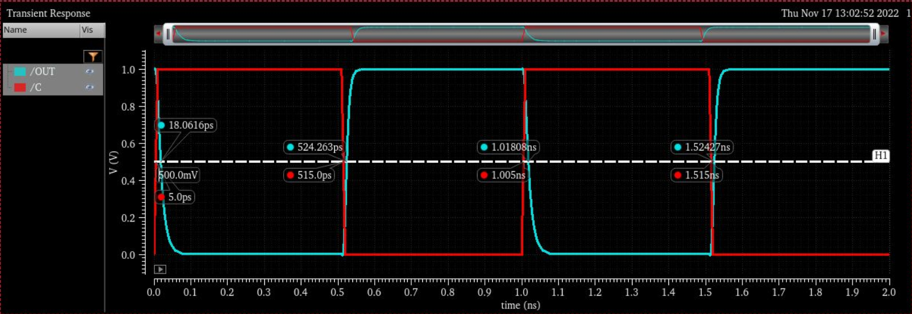

University of British Columbia  

*Isabelle Andre*  

# Project 4 NAND3 Layout & Logic Function
This project consisted in using the Cadence Design tools to layout and characterize a NAND3 circuit. First, the sizing of the transistors of the NAND3 gate are calculated using theoretical inverter sizing. A layout is then created, verifying the design using DRC, LVS, then extracting the parasitic components from the layout. The layout was designed with the aim of reducing the time delay and area as much as possible. Next, a logic circuit is analyzed and simulated to find its worst case rising and falling delays. Finally, the RC and Elmore delays for a transmission gates circuit are calculated, and optimized by deriving an optimal output inverter size.

# NAND3 Simulation & Layout
A symmetrical NAND3 gate is designed on Cadence with equal tpLH and tpHL delays, measured from 50% to 50%. The aim of this simulation is to obtain a time difference within 5ps. We use an input clock slew rate of 10ps, with a 10fF load capacitance, and a VDD of 1V. The goal of this assignment is to design the smallest and fastest NAND3 gate meeting the above requirements.

## NAND3 Schematics and Sizing
Using the standard sizing for an inverter of 2W for PMOS and 1W for NMOS, we design and calculate the theoretical widths for the NMOS and PMOS transistors. The PMOS width is calculated to be 2W each, and the NMOS are 3W. However, as these sizes do not meet the symmetric time requirements when simulated later, the widths are increased in simulation, therefore PMOS are 4W, and NMOS are 8W. A stick diagram such as in Figure 2.1 was designed to get an overview of the gate layout.

*Figure 2.1: NAND3 Stick Diagram*

We design the NAND3 Schematics that we will use for Layout comparison on Cadance. The following schematics in Figure 2.2 is created.

*Figure 2.2: NAND3 Cadence Schematics*

## NAND3 Layout and Pain
The layout diagram shown in Figure 2.3 was created using 3 NMOS pCells and 3 PMOS pCells, with 4 fin PMOS 8 fin NMOS. Note that certain details such as labels may not be fully observable when zoomed out of the layout in this figure.

*Figure 2.3: Full NAND3 Gate Layout View*

The following materials in Table 2.1 were added to the schematics and pCells to form connections.

| **NMOS pCell Connections** | **PMOS pCell Connections** | **Gates** | **Gate Interconnect** | **Metal Connections** | **Contacts** |
|----------------------------|----------------------------|-----------|-----------------------|-----------------------|--------------|
| PIM                        | NIM                        | GATEA     | GIL                   | M1A                   | V0           |

*Table 2.1: Used Design Materials List*

A closer snapshot of the NAND3 gate layout is included showing labels and more detail as shown in Figure 2.4. Adding rulers to measure the width and length of the layout, we see an approximate length of 0.758 um and width of 0.416 um. Using the built in Cadence function to calculate Area and Density of layout, an area of 0.375678 um^2 is obtained.

*Figure 2.4: NAND3 Layout PMOS pCells and Connections*

Each input pin A, B, and C are distanced 0.128 um from each other as measured from the center of their contact point and pin. The nearest pin C, is positioned a horizontal distance of 0.03 um, and 0.17 um vertically from the output pin Y. Further dimensioning and measured distance between pins of the layout are shown in Table 2.2.

|                              | **A - B - C** | **VDD - Y** | **C - Y** | **Y - GND** |
|------------------------------|---------------|-------------|-----------|-------------|
| **Horizontal Distance (um)** | 0.128         | 0.32        | 0.03      | 0.32        |
| **Vertical Distance (um)**   | 0             | 0           | 0.17      | 0.341       |

*Table 2.2: Horizontal and Vertical Distances of Layout Pins*

Over the development of the gate, the Design Rule Check (DRC) is used repeatedly to ensure that material geometries do not violate manufacturing capabilities for a valid design.

Next, we use Layout vs Schematic (LVS) to check for connectivity differences between layout and our schematic previously designed. The LVS report can be found in Appendix B.

Once the design is confirmed to be correct, we extract all parasitic resistances, capacitances, and inductances from the layout through Parasitic Extraction (PEX). The Netlist shown in Appendix C is extracted, and a circuit block is obtained for our NAND3 layout. Using this block, the testbench shown in Figure 2.5 is created. For the worst-case delay, inputs A and B are connected to VDD, and pulsing input is applied to input C with a clock skew rate of 10ps, therefore switching between ABC = 000 -> 001.

*Figure 2.5: NAND3 Layout Testbench*

The waveform shown in Figure 2.6 is simulated, resulting in a time difference between tpLH and tpHL of 0.929ps, as shown in Table 2.3, meeting design restrictions. Total time delay is obtained using:

$$ t_p = {tpHL + tpLH \over 2} $$

*Figure 2.6: NAND3 Layout Testbench Waveform*

| **tpHL (ps)** | **tpLH (ps)** | **Time Difference (ps)** | **Delay (ps)** |
|---------------|---------------|--------------------------|----------------|
| 9.431         | 10.36         | 0.929                    | 9.8955         |

*Table 2.3: Simulated Delays and Calculations*

Finally, the area x delay is calculated using the layout area obtained above using the Cadence tool as shown in Table 2.4.

| **Measured Length (um)** | **Measured Width (um)** | **Computed Area (um^2)** | **Delay (ps)** | **Area x Delay (um^2 x ps)** |
|--------------------------|-------------------------|--------------------------|----------------|------------------------------|
| 0.758                    | 0.416                   | 0.375678                 | 9.8955         | 3.71752                      |

*Table 2.4: Area x Delay Calculations*

