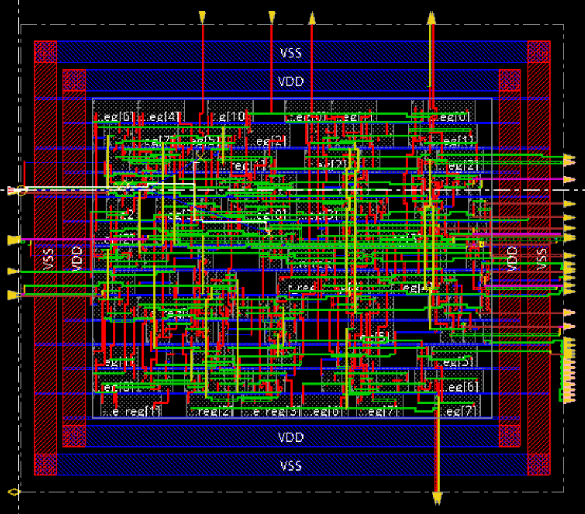
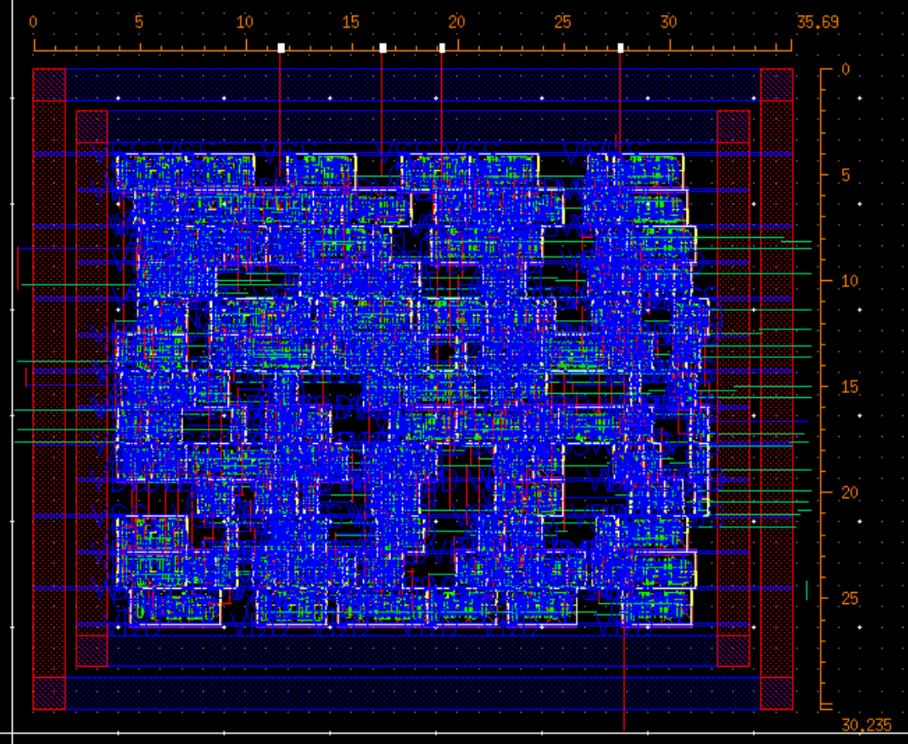
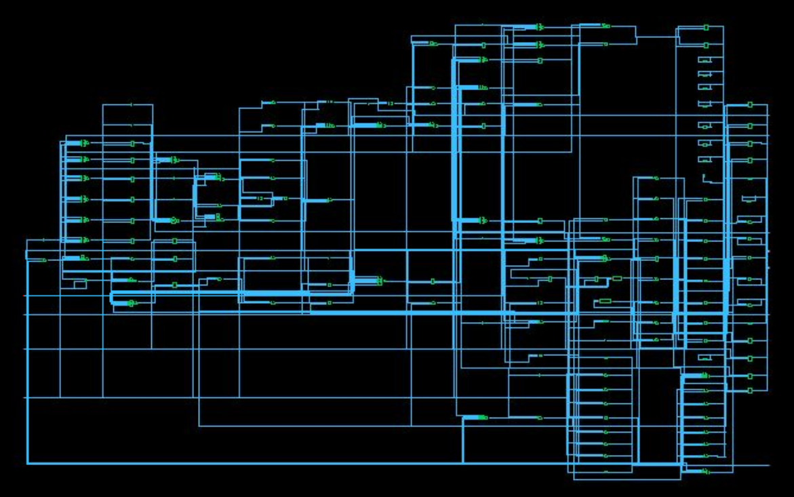
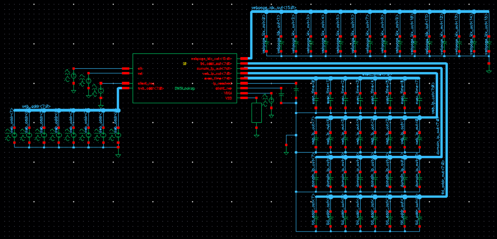

University of British Columbia  

*Isabelle Andre*  

# Project 5 Place and Route Domino Logic
This project consisted in using the Cadence Design tools to synthesize a Verilog DNSLookup state machine previously designed in Project 1 using a GPDK 45nm standard cell library. The synthesized design is then laid out and verified using the Cadence Innovus tool by auto-routing. In the next part of this project, domino logic is explored by determining voltage reduction under worst case charge sharing conditions. Minimum capacitance and delays are calculated for a transmission gate circuit, and static and dynamic power consumption is solved analytically and graphically. Finally Interconnect properties are explored by computing the resistance, capacitance, and delay for a distributed RC wire.

# Cadence Layout
Once the Verilog code was simulated and tested on modelsim, the mapped Verilog file was synthesized then auto-routed by running Innovus. The 45 nm PDK was used to synthesize Verilog code and run PnR. While running Innovus Place and Route, the input, output, VSS, and VDD pins were placed on the layout and power nets were configured.

After adding VSS and VDD rings, setting up power nets, and generating the layout, the layout in Figure 2.6 is obtained.

*Figure 2.6: Innovus Place and Route*

After exporting the layout to GDS and saving the Verilog file as a netlist, we begin the Post Place and Route on Virtuoso. After importing the GDS file, additional cells are generated as part of the layout, shown in Figure 2.7.

*Figure 2.7: Virtuoso Place and Route Cells*

To simulate the layout, we must import the generated Verilog file. A schematic as shown in Figure 2.8 and a symbol for the layout are generated.

*Figure 2.8: Generated Schematic From Imported Verilog*

From the generated symbol, the following testbench shown in Figure 2.9 is created. Each input bus is connected to a voltage source in order to simulate signals as described in the Verilog testbench created above, mocking the modelsim simulation. VSS is grounded using the cds_thru cell, and VDD is connected to a 1V DC source. Each individual signal from the block’s output buses are connected to a 10 fF capacitor. The clocking period is chosen as defined in the timing.sdc file, set to 100 ns.

*Figure 2.9: Layout Simulation Testbench*
